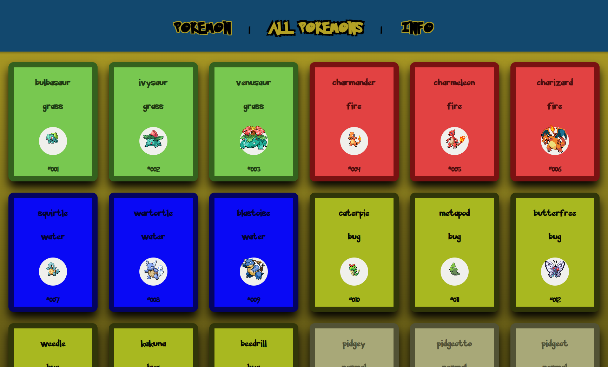
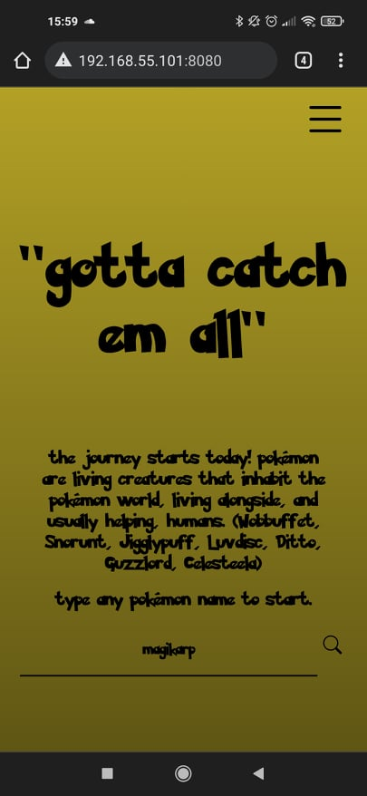
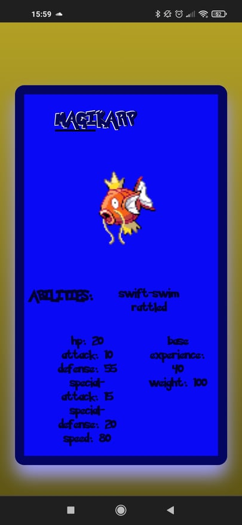

# Pokemon
The website was made with the Vue.js Framework. I also used other cool stuff, including scss, axios, iconify
Pokemon data that I fetch: https://pokeapi.co/

## View
#### Desktop view 
Pokemons list 


#### Mobile view
Main page \




```
ignore it :p 
git subtree push --prefix dist origin gh-pages
```
